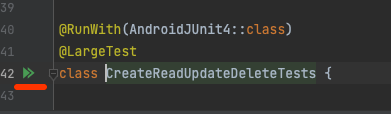
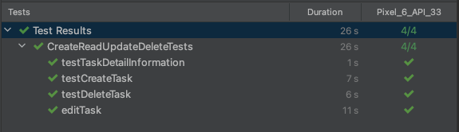
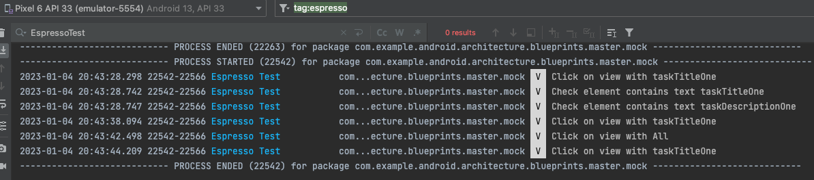

# Test assigment for Proton

## Prerequisites
- Running emulator
- Build gradle is finished

## Running the tests
To run the tests, follow these steps:

1) Make sure the prerequisites are installed
2) Open a terminal window and navigate to the project directory
3) Run the command 
```sh
  npm init playwright@latest
```
OR run tests with run button in IDEA



## Results


## Test framework architecture
The tests are written with pure espresso without using of external libraries. Page object patter was implemented using basic Kotlin + Espresso tools

## Logging 
Logs are available in adb logcat output with tag:espresso


## Built with
JUnit, Espresso

## Authors
Aleksandr Lozhkovoi